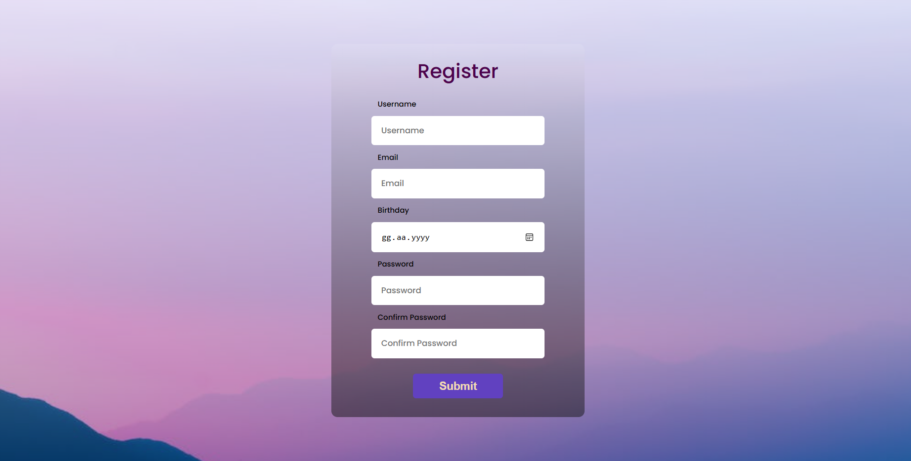

## React Registration Form

This repository features a simple React application dedicated to user registration. The form solicits key details such as username, email, date of birth, and password. The password field adheres to specific criteria, complemented by a confirmation input for heightened security.

### Features
- **User-friendly Interface:** Simplifies the registration process with an intuitive form layout.
- **Input Validation:** Ensures accuracy by validating username, email, and password inputs.
- **Password Confirmation:** Includes a confirmation field to verify password accuracy.
- **Error Handling:** Provides clear error messages for effective user feedback.

### Usage
1. **Download the Project:**
   - Clone or download the project files to your local machine.

2. **Install Dependencies:**
   - Open your terminal within the project directory.
   - Run `npm install` to install the required dependencies.

3. **Start the Application:**
   - In the terminal, run `npm start` to launch the application.

4. **View the Application:**
   - Visit [http://localhost:3000](http://localhost:3000) in your web browser to interact with the application.

### Screenshots

This uncomplicated form application prioritizes user security, providing an effective means for users to securely register by entering their information.
